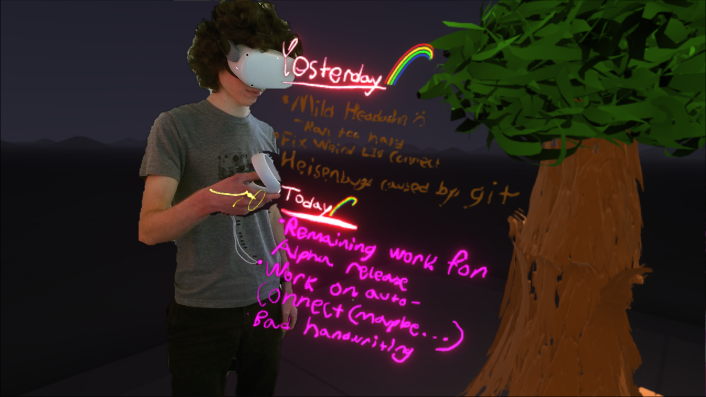

# Would it really be a personal site without a first post about the CMS?

So I've been meaning to redo my personal website for quite a while now, which is currently a big, bloaty self-hosted WordPress thing. It was neat when I set it up at the end of high school, but maintaining it and adding new content has since proven to be too annoying. So now there's this, a little Jekyll site hosted on GitHub Pages. I've been meaning to get this going for a while now, and some encouragement from Fastai's excellent [*Deep Learning For Coders* course/book](http://course.fast.ai) I've been working through recently finally got me to do it.

So we'll see how this goes! Will I make this first post, and completely abandon it later? Maybe! Will this post get lost in a sea of great content in a few months? Hopefully! Will I look back at my 20 year old self, and this post, with embarassment in a few years? Probably!

<figure>
  
  <figcaption>A random photo from today with no relevance at all to anything else in this post.</figcaption>
</figure>