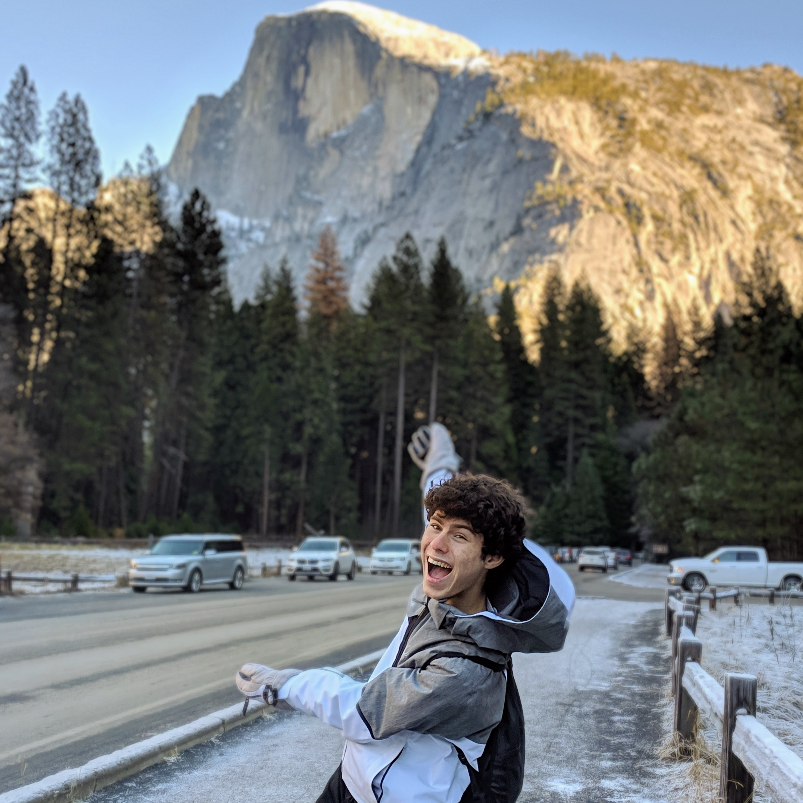

Why hello there! You have reached the personal website of David Goodman, or as most people seem to call me, "Sox". I'm still really not sure what I'm going to do with this site quite yet, but in the meantime, have a few bullet points about me:
- I did programmery things over at [LIV](http://liv.tv), where I worked on a bunch of cool projects. One of my proudest accomplishments was creating and doing the nerdy technical parts of our [mobile mixed reality app](https://www.youtube.com/watch?v=AXlZIKyh75k). After four amazing years it was time for a change, and I'm now looking for what's next.
- I love all things virtual, augmented, and mixed reality.
- I left school in 2020, to pursue what I believe will be a more complete education through work and self-learning.
- I care deeply about climate damage, having experienced [disastrously bad air quality](images/orangeskies.jpg). I currently volunteer with [Citizens' Climate Lobby](https://citizensclimatelobby.org/) to help get desparately-needed pollution fees into law in the US.
- I was born and raised in San Francisco (by non-techie parents!), where I currently live with my family, and our Guatemalan rescue dog.
- I've got 22 years on my age counter.
- You can watch me awkwardly ramble about my work at LIV on camera [here](https://www.youtube.com/watch?v=TOQ7CDKj4Rk).

